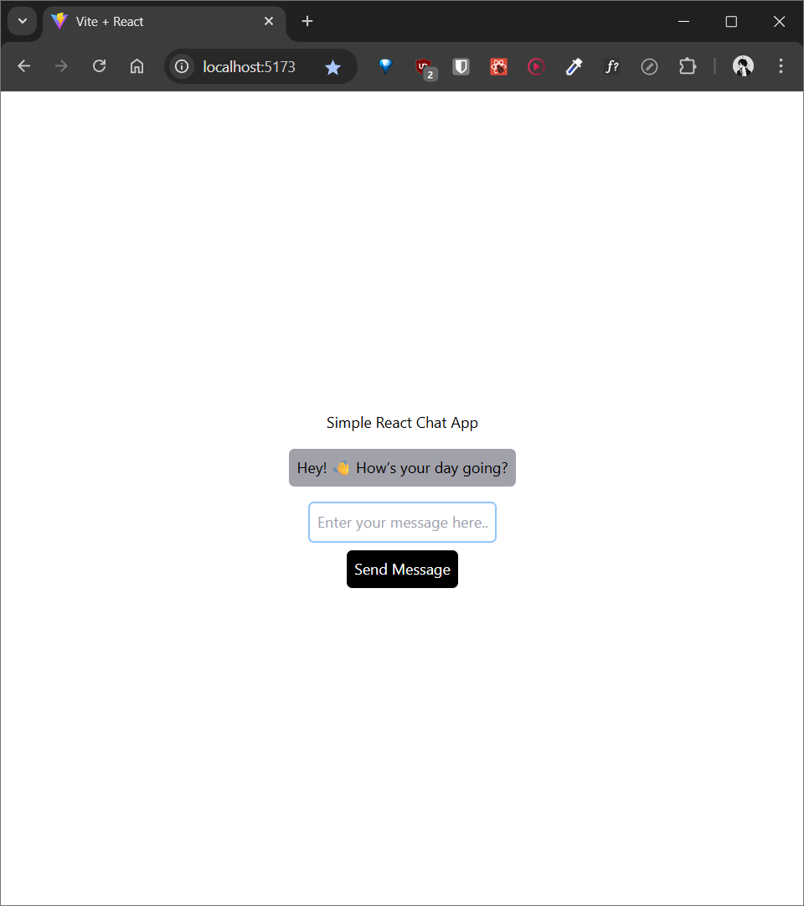
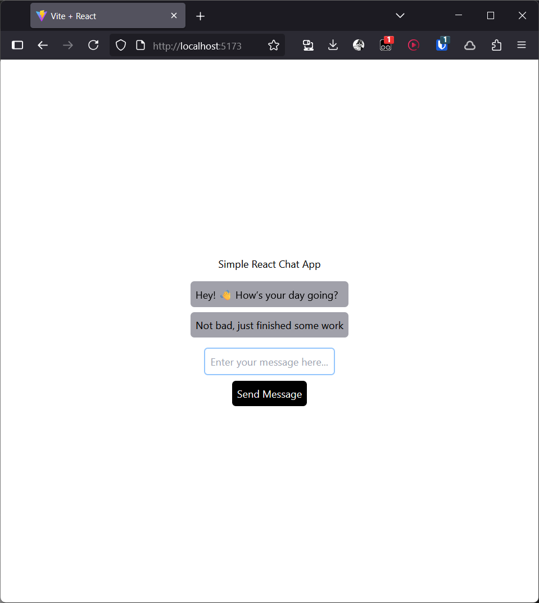
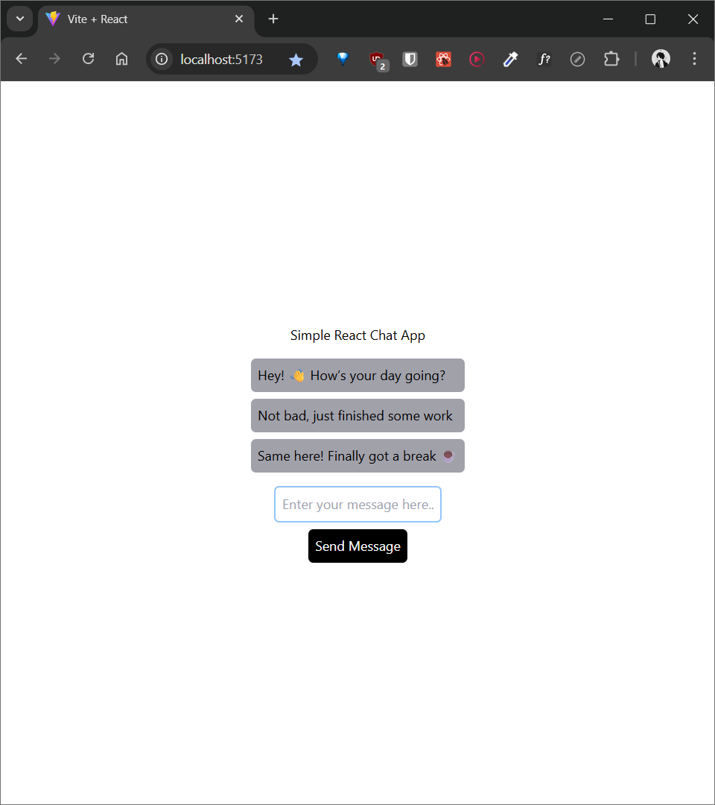

# 🧑‍💻 Basic React Chat App using Socket.IO

A simple real-time chat application built with **React** on the client-side and **Node.js + Socket.IO** on the server-side.


## 📦 How to Run on Your Local System

Follow the steps below to clone, install, and run the project locally:

### 1. Clone the Repository

```bash
git clone "https://github.com/PawanPawar11/basic-react-chat-app-using-socket.io.git"
````

### 2. Open in a Code Editor

Use your favorite editor (e.g., **VS Code**, **WebStorm**, etc.).

---

## 🚀 Run the Client

### Step 1: Navigate to the client directory

```bash
cd client
```

### Step 2: Install dependencies

```bash
npm i
```

This will install all the required packages for the client.

---

## 🚀 Run the Server

### Step 1: Navigate to the server directory

```bash
cd server
```

### Step 2: Install dependencies

```bash
npm i
```

This will install all the required packages for the server.

---

## 🧪 Run Both Client & Server

1. Open **two terminals**:

   * One inside the `client` folder
   * One inside the `server` folder

2. In the **client terminal**, run:

   ```bash
   npm run dev
   ```

   * Press `o` and hit Enter if prompted to open in browser.
   * The client will run at: [http://localhost:5173](http://localhost:5173)

3. In the **server terminal**, run:

   ```bash
   npm start
   ```

---

## 🧪 Test the Chat App

* Open [http://localhost:5173](http://localhost:5173) in **two different browsers**.
* Try sending messages from one browser.
* You'll see real-time communication — both clients will receive messages instantly without refreshing or losing sessions.

---

## 🖼️ Screenshots

### Conversation 1



---

### Conversation 2



---

### Conversation 3



---

## 📚 Libraries Used

### ✅ Client-side:

* `socket.io-client`

### ✅ Server-side:

* `socket.io`
* `express`
* `nodemon`
* `cors`

